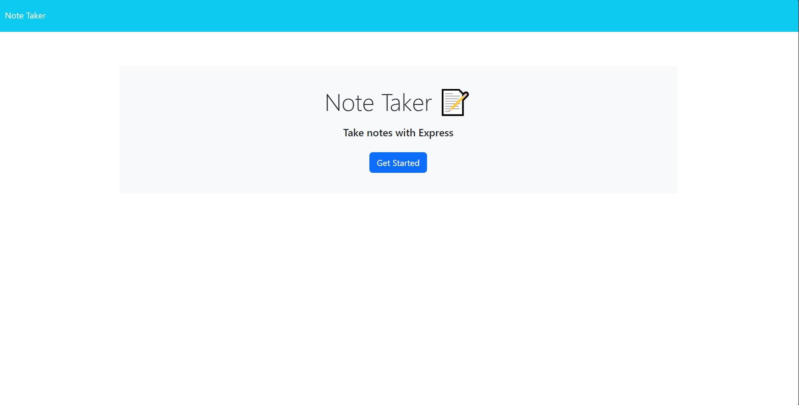
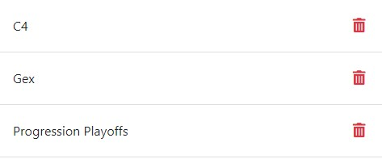

# Note Taker

## Description

As a small business owner, it is up to me to keep tabs on what work needs to be done. I am my own boss, and I need to hold myself accountable. The sticky notes in my office are far too many for me to count, so I have come up with a web application that will allow me to write all of my thoughts and tasks in one place. In doing this, I save paper, as well as my sanity (being the only employee of my business). This has proved to be incredibly helpful, and I've learned yet another way how to deploy an application to a server in such a way where I can support it from both the front and back ends.

## Usage

Here is a preview of what the website looks like: https://serene-retreat-50515-ba45d9b1595d.herokuapp.com/

After clicking get started, the user can begin making notes. After giving a note a title and description, the user can save that note by clicking the 'save' icon in the top right of the website, and their saved notes can be found within the column on the left.

To add a new note, the user can press on the '+' icon in the top right of the website, right next to where the 'save' icon can be found.

To revisit an old note, the user can simply click on the title of a note that is found within the column list on the left. To delete an existing note, each note within the column has a trash can icon that can be clicked to remove that note from the list.

## License

MIT License (please refer to LICENSE within GitHub repo for more information)